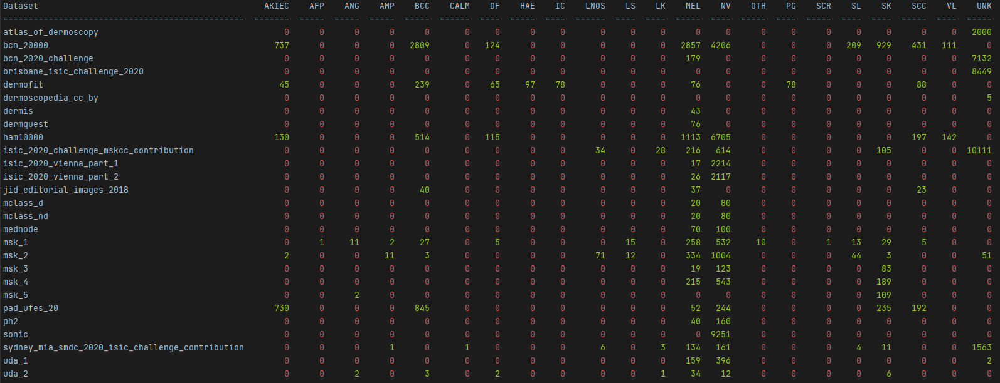

# SLA-CLI

[](https://gitHub.com/DavidWalshe93/SLA-CLI/graphs/commit-activity)
[](https://travis-ci.com/DavidWalshe93/SLA-CLI)
[](https://coveralls.io/github/DavidWalshe93/SLA-CLI)
[](https://app.codacy.com/gh/DavidWalshe93/SLA-CLI?utm_source=github.com&utm_medium=referral&utm_content=DavidWalshe93/SLA-CLI&utm_campaign=Badge_Grade_Settings)
[](https://opensource.org/licenses/MIT)
[](https://pypi.python.org/pypi/sla-cli/)
[](https://pypi.python.org/pypi/sla-cli/)
[](https://pepy.tech/project/sla-cli)

> A Skin Lesion Acquisition (SLA) CLI tool designed to help source data for skin lesion research.

## Introduction

While working on an academic project in the domain of automatic skin lesion detection it became clear that there was no
easy way to track down datasets cited highly in the literature

This is what motivated the creation of **SDA-CLI**.

**SDA-CLI** is targeted toward academic and medical researchers looking to source lesion dataset quickly to accelerate
their research efforts.

## Features at a Glance

**Available**

- Dataset summaries and label distribution.
- Console-based dashboards.
- Full support for downloading datasets + metadata from the ISIC Archive API.

**WIP**

- Matplotlib integration for data distribution visualisation.
- Dataset downloading (public datasets only).
- Metadata extraction on applicable datasets.
- Data background information sources and links.
- Preprocessing of datasets for *binary classification*.

## Datasets Available

The table below shows the dataset currently available to acquire via the tool.

| Dataset                                          | Available |
|--------------------------------------------------|:---------:|
| Altlas of Dermoscopy                             |     ❌     |
| BCN 20000                                        |     ✅     |
| BCN 20000 Challenge                              |     ✅     |
| Brisbane ISIC Challenge 2020                     |     ✅     |
| DERMOFIT                                         |     ❌     |
| Dermoscopedia (CC BY)                            |     ✅     |
| DermIS                                           |     ⚠️     |
| DermQuest                                        |     ⚠️     |
| HAM10000                                         |     ✅     |
| ISIC 2020 Challenge MSKCC Contribution           |     ✅     |
| ISIC 2020 Vienna Part 1                          |     ✅     |
| ISIC 2020 Vienna Part 2                          |     ✅     |
| JID Editorial Images 2018                        |     ✅     |
| MClass (Dermoscopy)                              |     ⚠️     |
| MClass (Dermoscopy)                              |     ⚠️     |
| MEDNODE                                          |     ⚠️     |
| MSK-1                                            |     ✅     |
| MSK-2                                            |     ✅     |
| MSK-3                                            |     ✅     |
| MSK-4                                            |     ✅     |
| MSK-5                                            |     ✅     |
| PAD-UFES-20                                      |     ⚠️     |
| PH2                                              |     ⚠️     |
| SONIC                                            |     ✅     |
| Sydney MIA SMDC 2020 ISIC Challenge Contribution |     ✅     |
| UDA-1                                            |     ✅     |
| UDA-2                                            |     ✅     |

- ✅ - Fully implemented
- ⚠️- Work in progress.
- ❌ - Private dataset

## Loading Configurations

There are three ways to load configuration files when using the CLI interface.

1) The first method is using an explicit YAML configuration file like so:

    ```shell
    sla-cli -f/--config-file <FILE_PATH> <COMMAND> ...
    ```

<br>

2) The second method is referencing the **SLA_CLI_CONFIG_FILE** environment variable. Once the variable is set, it will
   auto-reference the environment variables value, which should be a path to the configuration file you wish to load
   into the tool.

<br>

3) The third and final method of loading a configuration with the tool is creating a "*.sla_cli_config.yml*" file in the
   directory you plan to run the tool in. This method is helpful if you wish to check-in your configuration to SCM.

## Commands

The following sub sections discuss the how to use the tool.

The following conventions are used to describe tool usage.

```shell
<NAME>                 ---> Required argument.

[NAME: DEFAULT_VALUE]  ---> Optional argument showing default value. 
```

If unsure of how to use a command, use **-h/--help** on any command to get context on what commands are available and
what they do.

### ls

The **ls** command is to gain quick insight into what data is available.

```shell
sla-cli ls [regex: '.*']              # Shows a list of dataset names available.
sla-cli ls -v totals [regex: '.*']    # Shows a list of dataset names and the number of images it contains.
sla-cli ls -v all [regex: '.*']       # Shows a list of dataset names and a full breakdown of all image label distribution
```

A sample of the **sla-cli ls -v all** output is shown below:


*Sample output of 'sla-cli ls -v all' command.*